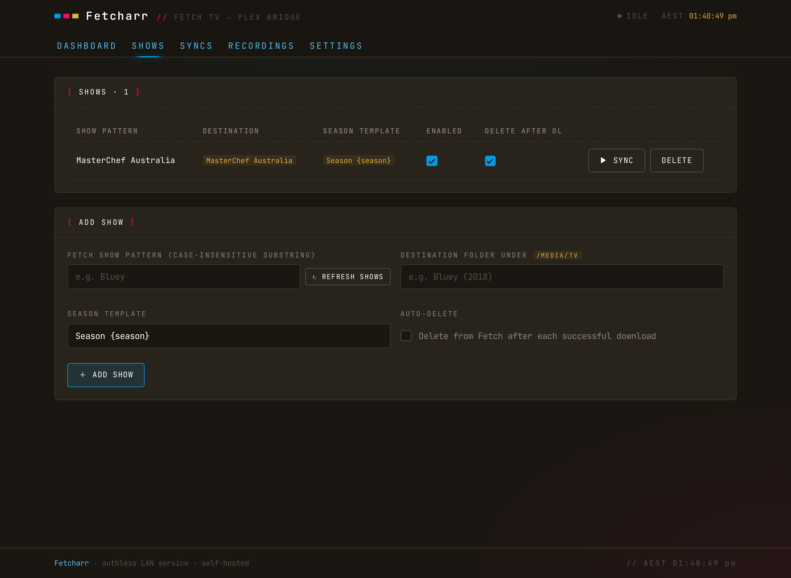
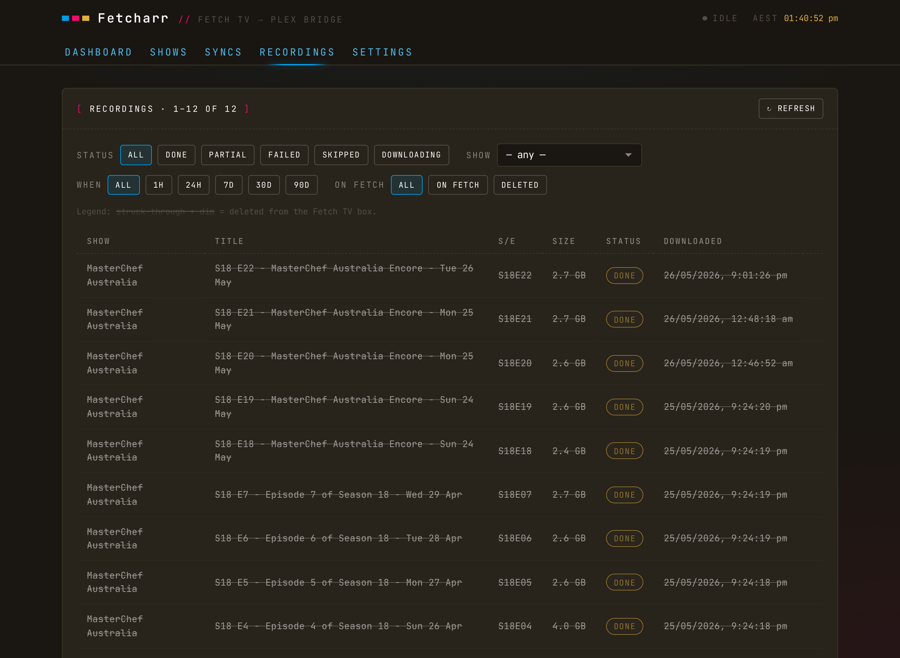
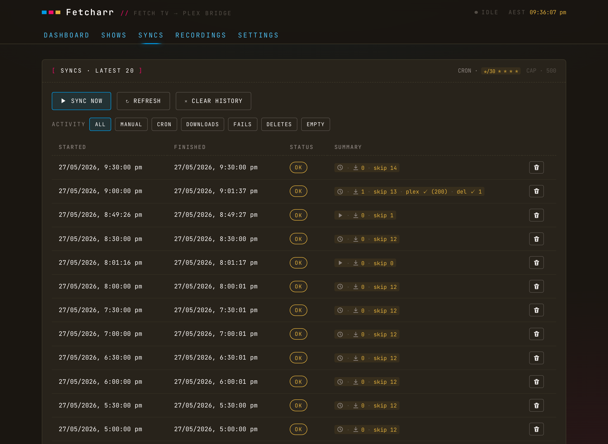
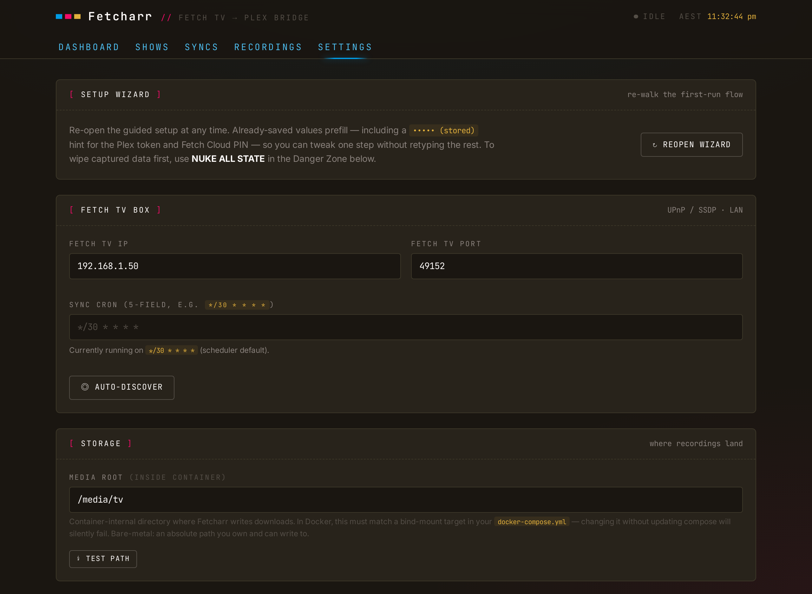

<p align="center">
  
</p>

<p align="center">
  <strong>Sync Fetch TV PVR recordings into Plex.</strong><br/>
  A self-hosted bridge for Australian Fetch TV DVB-T set-top boxes.
</p>

<p align="center">
  
  
  
  
  
</p>

## Contents

- [What Fetcharr is](#what-fetcharr-is)
- [What Fetcharr isn't](#what-fetcharr-isnt)
- [Features](#features)
- [Prerequisites](#prerequisites)
- [Quick start](#quick-start)
- [Configuration](#configuration)
- [Security](#security)
- [Technical deep dive](#technical-deep-dive)
- [Troubleshooting](#troubleshooting)
- [Disclaimer](#disclaimer)
- [Contributing](#contributing)
- [Support](#support)
- [Licence](#licence)

## What Fetcharr is

Your Fetch TV box records the shows you tell it to, then the recordings sit on the box, watchable only through Fetch's own interface. **Fetcharr** watches the box on your LAN, downloads new episodes of shows you mark to follow, drops the files into your Plex TV library, pokes Plex to scan, and optionally deletes the recording from the Fetch box once Plex confirms the file.

If your media stack is Fetch TV → Plex, Fetcharr is the automation in between: schedule recordings on the box as usual, and they turn up in Plex named and foldered.

<p align="center">
  
  <br/><em>Dashboard</em>
</p>

<p align="center">
  
  <br/><em>Shows</em>
</p>

<p align="center">
  
  <br/><em>Recordings</em>
</p>

<p align="center">
  
  <br/><em>Syncs</em>
</p>

<p align="center">
  
  
  
  <br/><em>Mobile</em>
</p>

## What Fetcharr isn't

- ❌ **An indexer integration** (Sonarr / Radarr / Prowlarr): Fetcharr only consumes what Fetch has already recorded; it doesn't tell Fetch *what* to record. Use the box's own EPG to schedule recordings.
- ❌ **Authenticated:** designed for trusted LAN deployments. CSRF, rate-limiting, and a strict CSP are in place, but there's no login. Don't expose it to the internet (see [Security](#security)).
- ❌ **A remuxer / transcoder:** files land as `.ts` from the box and stay `.ts` — the optional ad-cutting is a keyframe stream-copy, not a re-encode. Add Tdarr or similar downstream if you need `.mkv`.
- ❌ **A notifier:** no Discord / ntfy / push integration.

> [!IMPORTANT]<br>
> Tested against a Fetch TV Mighty 3 and Plex Media Server. Other Fetch hardware/firmware is unverified.

## Features

- **Zero-config discovery**: finds your Fetch TV box (SSDP) and Plex server (GDM) on the LAN, and auto-detects the Plex token from a bind-mounted `Preferences.xml`.
- **First-run wizard**: walks Fetch box → storage → Plex → optional Fetch Cloud. Re-openable from Settings; previously-saved values prefill.
- **Per-show follow**: pick a Fetch show, fuzzy-match it to an existing folder under your media root, and set a season template.
- **Scheduled + manual sync**: cron-configurable polling, plus on-demand global or per-show Sync now.
- **In-progress recording protection**: refuses to download a half-recorded show. Fetch reports misleading sizes during live record; Fetcharr catches the sentinels (and HEAD-probes stale DLNA metadata) so you never end up with truncated files.
- **Resumable, truncation-aware downloads**: HTTP Range resume across syncs; if on-disk bytes fall short of what Fetch reported, the row stays `partial` and the next sync picks up the remainder.
- **Plex integration**: section refresh after every sync that downloaded something, plus a Refresh Plex now button.
- **Optional delete-from-Fetch**: once Plex confirms the file, free up the box. This goes through Fetch's cloud API because the box's LAN-side delete is broken; [`docs/DEEP_DIVE.md`](docs/DEEP_DIVE.md#why-delete-from-fetch-goes-through-the-cloud-not-lan) has the full story.
- **Optional ad removal**: comskip-based commercial detection with a detect-only audit mode, keyframe stream-copy cutting (no transcode), and `.orig` backups of every cut file. Off by default; detection accuracy on free-to-air varies by channel, so trial detect mode before trusting cuts. See [`docs/DEEP_DIVE.md`](docs/DEEP_DIVE.md#ad-removal).
- **Live operation progress**: downloads, ad scans, and cuts report inline in the Recordings tab (a download bar with byte rate and ETA, a duration-estimated scan bar that counts down, a cut segment counter); the list polls every 2 s while anything is active instead of the idle 60 s. See [`docs/DEEP_DIVE.md`](docs/DEEP_DIVE.md#live-progress-indicators).
- **Self-housekeeping**: sync history auto-prunes to the latest 500 rows; recording rows age out 30 days after delete-from-Fetch.
- **TZ-aware UI**: container `TZ` propagates to the browser; timestamps render in that zone regardless of which device hits the page.
- **Phone-friendly UI**: every view adapts below tablet width — tables become cards, filters become swipeable chip rows, and touch targets meet Apple's 44 pt guideline — so checking a sync from the couch works as well as from a desk.
- **Danger Zone**: one-click `NUKE ALL STATE` reset back to the welcome wizard. DB only; downloaded media files untouched.
- **Authless LAN service**: SQLite-backed, single Docker container, no external runtime dependencies once configured.

## Prerequisites

- A **Fetch TV Mighty** PVR on the same LAN as the host running Fetcharr (SSDP/UPnP discovery uses multicast, so Fetcharr's host must be on the same broadcast domain as the box).
- **Docker + Docker Compose** on that host.
- **Plex Media Server** is optional; Fetcharr runs without it, you just won't get the post-sync library refresh.
- A **Fetch cloud account** (activation code + PIN) is optional; it's required only if you want Fetcharr to delete recordings from the box after they sync.

## Quick start

### 1. Get the code

```sh
git clone https://github.com/furey/fetcharr
cd fetcharr
```

### 2. Configure

Copy `docker-compose.example.yml` to `docker-compose.yml`, then create a `.env` alongside it with your host paths:

```env
CONFIG_PATH=/path/to/your/config
DATA_PATH=/path/to/your/media
CSRF_SECRET=paste-openssl-rand-hex-32
TZ=Australia/Sydney
PUID=1000
PGID=1000
FETCHARR_PORT=8124

# Optional: only if Plex runs on this host and you want the Auto-detect token
# button. Leave it out entirely if not — the mount defaults to a no-op.
# PLEX_PREFS_PATH=/path/to/Plex/Preferences.xml
```

`CONFIG_PATH`, `DATA_PATH`, and `CSRF_SECRET` are required; compose stops with a clear message if any is missing rather than starting with broken mounts.

### 3. Start it

```sh
docker compose up -d
docker compose logs -f
```

> [!IMPORTANT]<br>
> The example compose uses `network_mode: host` because SSDP multicast (`239.255.255.250:1900`) does not traverse Docker's bridge network. Without host networking, Auto-discover can't find the Fetch box.

### 4. Run the wizard

Browse to `http://<host-ip>:8124`. The first visit opens a setup wizard that walks you through the Fetch box (with Auto-discover), storage (with a TEST PATH button), Plex, and the optional Fetch Cloud step. Everything is editable later in Settings, and the wizard can be re-opened from there at any time.

Mark shows to follow on the Shows tab and Fetcharr syncs them on the schedule you set.

### Updating

```sh
git pull
docker compose up -d --build fetcharr
```

This rebuilds the image and recreates the container only if the image actually changed; your state database is untouched, and any pending migrations run automatically on next boot.

## Configuration

The Fetch TV box address and all integration credentials (Plex token, Fetch cloud activation code, etc.) are runtime settings; configure them in the web UI, not via env. The `.env` next to your compose file only carries deploy-level knobs:

| Variable          | Purpose                                                                                                           |
| ----------------- | ----------------------------------------------------------------------------------------------------------------- |
| `CONFIG_PATH`     | Host folder for Fetcharr's state database                                                                         |
| `DATA_PATH`       | Host folder containing your Plex TV library (downloads land under `media/tv`)                                     |
| `PLEX_PREFS_PATH` | Optional. Path to Plex's `Preferences.xml`, used by the Auto-detect token button; omit if Plex is on another host |
| `CSRF_SECRET`     | 32+ random bytes (`openssl rand -hex 32`); required                                                               |
| `TZ`              | Your IANA timezone (e.g. `Australia/Sydney`); the UI renders all timestamps in it                                 |
| `PUID`/`PGID`     | UID/GID to run as; match the owner of your bind-mounted folders                                                   |
| `FETCHARR_PORT`   | Host port to serve on (default `8124`)                                                                            |

The full environment reference, including the settings fallback chain, is in [`docs/DEEP_DIVE.md`](docs/DEEP_DIVE.md#full-environment-reference).

**Ad removal** is configured at runtime, not via env: enable it in Settings → AD REMOVAL (off by default), then pick a per-show mode on the Shows tab — `DETECT` records where the ad breaks are without touching the file, `CUT` removes them and keeps the original as `<file>.ts.orig` for a configurable number of days (default 7). Fetcharr ships a comskip.ini tuned for Australian free-to-air; drop your own `comskip.ini` into the `/config` bind mount to override it.

<p align="center">
  
  <br/><em>Settings</em>
</p>

## Security

Fetcharr has no login; anyone who can reach the port can view state and change settings. CSRF protection, rate limiting, a strict CSP, and `noindex` headers are all in place, but the design assumes a trusted home LAN: don't port-forward or reverse-proxy it to the internet. Supply-chain hardening, the HTTP security headers, and the rationale behind each measure are covered in [`docs/DEEP_DIVE.md`](docs/DEEP_DIVE.md#security-model); vulnerability reporting and accepted residual risks are in [SECURITY.md](SECURITY.md).

## Technical deep dive

Architecture diagrams, the sync state machine, the delete-from-Fetch cloud rationale, the full environment reference, Docker deployment, the security model, local development, and more are all in [`docs/DEEP_DIVE.md`](docs/DEEP_DIVE.md).

## Troubleshooting

**Auto-discover can't find the Fetch box**

- The container must run with host networking (the example compose already does); SSDP multicast doesn't cross Docker's bridge network.
- The host must be on the same LAN/broadcast domain as the box; multicast doesn't cross subnets without help.
- You can always enter the box's IP and port manually in Settings instead.

**Plex token auto-detect fails**

- It needs Plex's `Preferences.xml` bind-mounted into the container (`PLEX_PREFS_PATH`), which only works when Plex runs on the same host.
- Paste the token manually instead; grab it from `app.plex.tv` (or Plex's own support article on finding your token).

**An episode was skipped with "currently recording"**

- That's deliberate: Fetch reports misleading sizes while a recording is live, so Fetcharr refuses to download it rather than save a truncated file. It syncs on the next run after the recording finishes.

**A recording shows `partial`**

- The downloaded bytes fell short of what Fetch reported. The next sync resumes from where it stopped (HTTP Range), so partials normally heal themselves.

**Delete-from-Fetch fails with "No I_AM_ALIVE reply" (or "Timed out waiting for I_AM_ALIVE handshake")**

- The reply comes from your Fetch box via Fetch's cloud, and a box whose cloud session has dozed off misses the ping even though it works fine on the LAN. Fetcharr pings twice (20 s) before giving up, and the first attempt usually wakes the box's session — so just retry the delete after a moment.
- If it keeps failing, open the official Fetch mobile app: if the app can't see the box either, the box↔cloud link is down; restarting the box resets it. [`docs/DEEP_DIVE.md`](docs/DEEP_DIVE.md#why-delete-from-fetch-goes-through-the-cloud-not-lan) has the mechanics.

**Other containers can't reach Fetcharr by name**

- A side-effect of host networking: Fetcharr isn't on any Docker bridge network. Reach it via the host's LAN IP and `FETCHARR_PORT` instead.

**Ad detection is cutting the wrong things (or missing breaks)**

- Commercial detection is heuristic and never perfect. Comskip's accuracy on AU free-to-air varies noticeably by channel (logo detection, silence thresholds, break lengths all differ).
- Run the show in `DETECT` mode first and check the reported break counts/minutes on the Recordings tab before switching to `CUT`. Scans are CPU-bound: budget ~30 minutes per 75-minute recording on NAS-class hardware.
- Cuts snap to keyframes, so a second or two of slop either side of a break is expected.
- To tune detection, place your own `comskip.ini` in the `/config` bind mount; it overrides the bundled AU-tuned default. Every cut keeps a `<file>.ts.orig` backup for the retention window, so a bad cut is recoverable by renaming the `.orig` back.

**Timestamps show the wrong time**

- Set `TZ` in your `.env` to your IANA zone; the UI renders every timestamp in the container's zone, whatever device you're browsing from.

**Permission errors writing to `/config` or `/media/tv`**

- Set `PUID`/`PGID` to match the owner of the bind-mounted host folders.

## Disclaimer

This project:

- Is licensed under the [GNU GPLv3 License](./LICENSE).
- Is not affiliated with or endorsed by Fetch TV or Plex.
- Is built on top of the [`fetchtv`](https://github.com/furey/fetchtv) npm package for LAN-side Fetch TV access.
- Is written with the assistance of AI and may contain errors.
- Is intended for educational and experimental purposes only.
- Is provided as-is with no warranty; use at your own risk.

## Contributing

If you hit a problem or want to compare notes, start a thread in [Discussions](https://github.com/furey/fetcharr/discussions).

## Support

If you've found this project helpful consider supporting my work through:

[Buy Me a Coffee](https://www.buymeacoffee.com/furey) | [GitHub Sponsorship](https://github.com/sponsors/furey)

Your support helps me keep developing the project and adding new features.

## Licence

GPL-3.0-or-later. See [LICENSE](LICENSE).
