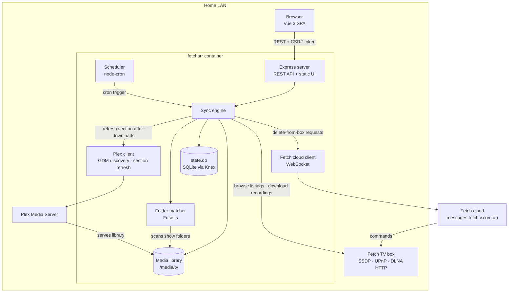
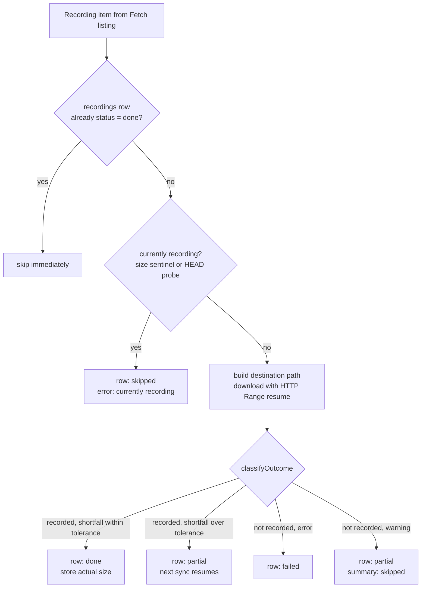

# Technical Deep Dive

The technical companion to [`README.md`](../README.md): what Fetcharr is doing under the hood, and why it works the way it does.

## Contents

- [Architecture](#architecture)
- [Sync state machine](#sync-state-machine)
- [Why delete-from-Fetch goes through the cloud, not LAN](#why-delete-from-fetch-goes-through-the-cloud-not-lan)
- [Ad removal](#ad-removal)
- [Full environment reference](#full-environment-reference)
- [Docker deployment](#docker-deployment)
- [`fetchtv` dependency](#fetchtv-dependency)
- [Security model](#security-model)
- [Local development](#local-development)
- [Project layout](#project-layout)
- [Scripts](#scripts)
- [Testing](#testing)
- [Regenerating the README screenshots](#regenerating-the-readme-screenshots)

## Architecture



A single Node process runs everything. The Express server (`src/server.js`) serves the Vue 3 SPA and the REST API; the scheduler (`src/scheduler.js`) wires `node-cron` to the sync engine and reloads whenever the cron setting changes; the sync engine (`src/sync.js`) discovers the Fetch box, browses its DLNA listings, matches recordings to followed shows, downloads new episodes into the media library, and persists every outcome to SQLite. After any sync that downloaded something, the Plex client (`src/plex.js`) refreshes the configured library section. Deleting a recording from the box goes through the Fetch cloud client (`src/fetch-cloud.js`) over WebSocket, because the LAN-side delete API is broken (see [below](#why-delete-from-fetch-goes-through-the-cloud-not-lan)).

## Sync state machine

The sync engine processes each item Fetch returns through this decision tree:



1. **Already-done short-circuit**: if a `recordings` row exists with `status='done'`, skip immediately.
2. **In-progress guard**: `await isCurrentlyRecording(item)` (from `fetchtv`) returns `true` when the UPnP listing reports size <= 0 (Fetch's `-1` "size unknown" sentinel) or the MAX_OCTET marker (`4398046510080`), or when a HEAD probe reveals a content-length matching the marker. On any of those, write the row as `skipped` with `error='currently recording'` and bail.
3. **Download**: build the destination path from the show's `dest_folder` + `season_template`, mkdir, then call `downloadFile`. The downloader supports HTTP Range resume; a partial-from-last-time row will pick up where it left off rather than re-downloading.
4. **Classify the outcome** via `classifyOutcome({ downloadResult, expectedSize, actualSize, tolerance })`, a pure function (exported for tests) that returns `{ dbStatus, summaryKey, sizeToStore, markDownloadedAt, error }`:
   - `result.recorded && shortfall ≤ tolerance` → `done` / `downloaded`, store actual size.
   - `result.recorded && shortfall > tolerance` (default 1 MB) → `partial` / `failed`, store actual size, error explains the byte gap. Next sync's resume will fix it.
   - `result.recorded && actualSize unknown` (post-download `fs.stat` failed) → `done`, trust expected.
   - `result.recorded && expectedSize <= 0` → `done` (guard; shouldn't reach this branch in practice).
   - `!result.recorded && result.error` → `failed` / `failed`, sizeToStore stays null (leaves existing row's size alone).
   - `!result.recorded && result.warning` (e.g. "currently recording" warning from downloadFile) → `partial` / `skipped`.

Every branch of `classifyOutcome` is covered by `test/sync.test.js`. The wider sync flow (DB writes, `downloadFile` invocation, mkdir, Plex notify) lives outside `classifyOutcome` and is currently exercised end-to-end against the real Fetch box rather than via integration tests.

If a sync ran without any `result.error` but did get one or more truncations, the sync is marked `partial` overall; only summary `failed > 0` triggers a non-`ok` sync status. Truncations land in `summary.failed` (not `summary.skipped`) so they're visible at a glance.

## Why delete-from-Fetch goes through the cloud, not LAN

The original plan was UPnP `DestroyObject` from upstream [`fetchtv`](https://github.com/furey/fetchtv), which turned out to be impossible:

- Fetch firmware advertises `DestroyObject` in its ContentDirectory SCPD but the request handler rejects it with `Unknown Service Action`.
- HTTP `DELETE` on item URLs returns 501.
- No vendor-specific local services are advertised.

The only working deletion path is Fetch's cloud APIs (HTTPS auth + WebSocket to `messages.fetchtv.com.au` with the user's activation code + PIN; see [`pyfetchtv`](https://github.com/jinxo13/pyfetchtv) for the reference implementation).

## Ad removal

Free-to-air recordings carry their commercial breaks. Plex has no marker API for non-DVR library items and doesn't read EDL sidecar files, so skip markers are a dead end — the only end state that actually helps playback is physically cutting the breaks out of the file. Fetcharr does this with two spawned binaries (`comskip` for detection, `ffmpeg`/`ffprobe` for cutting; both baked into the Docker image, never npm deps) and a safety design that assumes detection will sometimes be wrong.

The feature is double-gated: a global `ad_removal_enabled` setting (Settings → AD REMOVAL, default off) and a per-show mode (`off` / `detect` / `cut`, default `off`). Processing runs inline in the sync loop, immediately after a download classifies `done` (never on `partial`), and everything is wrapped so a failure can never kill the sync or damage the recording.

**Detect** runs comskip against the file with an EDL output forced on (the resolved ini is copied to a temp file with `output_edl=1` appended — last key wins in comskip — so a user-supplied ini can't silently disable it), parses the EDL, and stores the breaks as JSON on the `recordings` row (`ad_status='detected'`, `ad_breaks_json`). The file is untouched. This mode exists so users can audit comskip's accuracy on their channels before letting it cut anything.

**Cut** continues from detection:

1. `ffprobe` reads the container duration; `computeKeepSegments` inverts the merged, clamped break list into keep segments. An empty keep list (breaks covering the whole file) is treated as a failure — Fetcharr never produces an empty output.
2. Each keep segment is extracted with `ffmpeg -ss … -to … -c copy` (keyframe stream-copy, no transcode; output stays `.ts`), then the segments are concatenated with ffmpeg's concat demuxer. All intermediate files live in a hidden `.fetcharr-adcut/` workdir next to the recording — same filesystem, so the final swap is an atomic rename, and hidden so Plex ignores it. The workdir is removed on every exit path.
3. **Verify then swap**: the output must be non-empty and its ffprobe duration must match the summed keep-segment duration within a tolerance that scales with boundary count (`max(5, 2 × boundaries)` seconds — keyframe snapping costs up to a couple of seconds per cut point). Only then does the swap happen: original → `<file>.ts.orig`, output → original name; if the second rename fails the `.orig` is rolled back. Plex ignores the unknown `.orig` extension.
4. Any failure at any step leaves the original file exactly where it was and marks the row `cut_failed`; the sync carries on.

`.orig` backups are pruned after a configurable retention window (`ad_original_retention_days`, default 7) during sync housekeeping, giving a recovery window for bad cuts (rename the `.orig` back).

**Delete-from-Fetch gating**: for a `cut`-mode show, the copy on the Fetch box is the last pristine source once the local file has been rewritten. Auto-delete is therefore only queued when the cut verified (or no breaks were found); a `cut_failed` or detect-only outcome keeps the box copy. This composes with the existing Plex-refresh delete guard.

**comskip.ini resolution**: Fetcharr bundles `assets/comskip.ini`, tuned for Australian free-to-air DVB-T (detection method, break-length windows, brightness/silence thresholds, logo detection). Detect-mode runs against real Network 10 captures (July 2026) found the expected pattern — five 2.5–4-minute ad blocks per ~75-minute episode plus occasional pre-roll/tail slivers — so the bundled ini is a sane default for at least that channel; others remain untested. If `comskip.ini` exists in the config dir (the `/config` bind mount), it wins. `GET /api/settings` reports which one is active and the Settings panel displays it.

**Manual scans**: `POST /api/recordings/:fetch_id/ad-scan` (re)processes an already-downloaded recording using the show's mode (detect-only when the show is `off`), so existing files can be trialled without redownloading. The endpoint responds `202` immediately and processes in the background; one manual scan runs at a time, and the UI polls the recordings list for the resulting `ad_status`.

Comskip is CPU-bound — expect roughly half an hour for a 75-minute 1080i broadcast `.ts` (~2.7 GB) on NAS-class hardware. It's spawned via `nice -n 10` so a scan doesn't starve the box of I/O for concurrent downloads, and per-recording statuses (`scanning`, `detected`, `no_breaks`, `cut`, `detect_failed`, `cut_failed`) surface on the Recordings tab.

## Full environment reference

The Fetch TV box IP/port and all integration credentials (Plex token, Fetch cloud activation code, etc.) are runtime settings; configure them in the web UI (or the first-run wizard), not via env. The env vars below are deploy/runtime knobs only.

> [!NOTE]<br>
> `MEDIA_ROOT` and `PLEX_PREFS_PATH` also act as defaults for matching DB-backed settings that can be overridden from the UI at runtime. The fallback chain is *settings DB value → env var → hardcoded default*. The Storage panel in Settings (and the STORAGE step of the wizard) shows the effective value and provides a TEST PATH button.

| Variable      | Notes                                                                                                                                                                                                                                                               |
| ------------- | ------------------------------------------------------------------------------------------------------------------------------------------------------------------------------------------------------------------------------------------------------------------- |
| `MEDIA_ROOT`  | Default for the `media_root` runtime setting (directory where Fetcharr writes downloads). Defaults to `/media/tv`. Override at runtime from the Settings UI's Storage panel.                                                                                        |
| `DB_PATH`     | Absolute path to the SQLite state file. Defaults to `<repo>/config/state.db`; compose sets it to `/config/state.db` so state lives on the bind mount.                                                                                                               |
| `PORT`        | HTTP port inside the container. Defaults to `8124`.                                                                                                                                                                                                                 |
| `NODE_ENV`    | `production` makes the server refuse to start if `CSRF_SECRET` is unset or the dev placeholder. Compose sets this.                                                                                                                                                  |
| `TZ`          | Container timezone (IANA name, e.g. `Australia/Sydney`). The Dockerfile installs `tzdata` so any IANA zone resolves. `/api/settings` exposes the value as `tz`; the web UI uses it to render all timestamps in that zone regardless of which browser hits the page. |
| `PUID`/`PGID` | Runtime UID/GID (set via compose `user:`). Defaults to `1000:1000`. Set to match the owner of the bind-mounted host paths.                                                                                                                                          |
| `CSRF_SECRET` | 32+ random bytes used to sign the CSRF cookie. `openssl rand -hex 32`. Required in production.                                                                                                                                                                      |

Compose-only env (set in `.env` alongside `docker-compose.yml`):

| Variable          | Notes                                                                                                                                                                                                                                                                                                                                                                                                                                                                                                            |
| ----------------- | ---------------------------------------------------------------------------------------------------------------------------------------------------------------------------------------------------------------------------------------------------------------------------------------------------------------------------------------------------------------------------------------------------------------------------------------------------------------------------------------------------------------- |
| `FETCHARR_PORT`   | Host port the container binds (under `network_mode: host`, also flows into `PORT` inside the container). Defaults to `8124`.                                                                                                                                                                                                                                                                                                                                                                                     |
| `CONFIG_PATH`     | Host root for the SQLite state bind mount. The container's `/config` is `${CONFIG_PATH}/fetcharr`.                                                                                                                                                                                                                                                                                                                                                                                                               |
| `DATA_PATH`       | Host root for media bind mounts. The container's `/media/tv` is `${DATA_PATH}/media/tv`.                                                                                                                                                                                                                                                                                                                                                                                                                         |
| `PLEX_PREFS_PATH` | Optional. Host path to Plex's `Preferences.xml`, bind-mounted read-only into the container so the "Auto-detect from local Plex" button can fish out `PlexOnlineToken`. Drop the bind-mount entirely from your compose if Plex isn't on this host; the auto-detect button degrades gracefully, and you can paste the token manually from `app.plex.tv`. Inside the container, the path defaults to `/plex-preferences.xml` and is overridable as the `plex_prefs_path` runtime setting (Settings panel for Plex). |

## Docker deployment

- The image is built locally from the repo via compose; nothing is pushed to a registry.
- The Dockerfile inlines `npm ci --ignore-scripts && npm run rebuild:natives` instead of calling `npm run setup`, deliberately skipping `npm audit signatures` at build time. That step re-queries the registry and enforces `.npmrc`'s `min-release-age=3`, which would block whenever a brand-new dep (e.g. a just-published `fetchtv` release) is in the lockfile. Run `npm run setup` (or `npm audit signatures`) on the host once the newest dep has aged past the threshold; the lockfile's integrity hashes still verify package contents during `npm ci`.
- Uses `network_mode: host` (no `ports:` mapping); required for SSDP/UPnP auto-discovery of the Fetch TV box, since multicast `239.255.255.250:1900` doesn't traverse Docker's bridge network. Side-effect: Fetcharr is not on any Docker bridge network; other containers reach it via the host's LAN IP on `${FETCHARR_PORT}` rather than by container name.
- Runs as `${PUID}:${PGID}` (default `1000:1000`) so bind-mounted files have the right owner.
- `tini` is PID 1 inside the container so `SIGTERM` propagates cleanly.
- The Docker healthcheck hits `GET /healthz` every 30s.
- The container entrypoint (`docker-entrypoint.sh`) runs `knex migrate:latest` against `/config/state.db` before exec'ing the server, so pending migrations apply on next boot and first boot on a fresh host is a no-op for the operator.
- `docker compose up -d --build fetcharr` rebuilds the image from the local `Dockerfile` and recreates the container only if its image actually changed; the bind-mounted `/config/state.db` is untouched.

Volumes:

| Container path               | Host path                 | Purpose                                                                                                                                                                                                                        |
| ---------------------------- | ------------------------- | ------------------------------------------------------------------------------------------------------------------------------------------------------------------------------------------------------------------------------ |
| `/config`                    | `${CONFIG_PATH}/fetcharr` | SQLite state DB; persisted across container recreate.                                                                                                                                                                          |
| `/media/tv`                  | `${DATA_PATH}/media/tv`   | Plex TV library (where downloads save to). Container-side path is the `MEDIA_ROOT` env default; can be overridden at runtime as the `media_root` setting (only useful if you mount the library at a different container path). |
| `/plex-preferences.xml` (ro) | `${PLEX_PREFS_PATH}`      | Optional. Local Plex `Preferences.xml` (read-only, only used by the "Auto-detect from local Plex" button to find `PlexOnlineToken`). Drop this volume entry if Plex isn't on the same host.                                    |

## `fetchtv` dependency

[`fetchtv`](https://github.com/furey/fetchtv) is installed as a regular npm dep, pinned exactly (no caret) per `.npmrc`'s `save-exact=true`. The pinned version is in `package.json`.

To bump fetchtv:

```sh
npm install --save-exact fetchtv@<new-version>
```

The `min-release-age=3` hardening rule in `.npmrc` will refuse versions newer than 3 days. If you need a hot bump (e.g. you just published a fix yourself), pass `--min-release-age=0` for that single command. The Docker build path is unaffected (it uses `npm ci` from the lockfile, which doesn't re-check the rule); only `npm audit signatures` (called by `npm run setup`) re-checks and will block until the package ages past the threshold; see [Docker deployment](#docker-deployment). Limit `--min-release-age=0` to packages you personally just published: the resulting `package-lock.json` change carries the fresh dep into every subsequent `npm ci` (Docker image rebuilds included), since lockfile integrity hashes verify content but not recency.

## Security model

Vulnerability reporting and the accepted residual risks from the transitive-dependency advisories are documented in [SECURITY.md](../SECURITY.md). The hardening measures:

- **`.npmrc`** sets:
  - `ignore-scripts=true`: never run lifecycle scripts during install. Native rebuilds are explicit via `rebuild:natives`.
  - `engine-strict=true`: fail install if `engines` mismatch.
  - `audit-level=high`: `npm audit` exits non-zero only on `high`+.
  - `save-exact=true`: new deps are pinned exactly.
  - `package-lock=true`: always write `package-lock.json`.
  - `min-release-age=3`: refuse packages newer than 3 days (mitigates rapid-fire supply-chain attacks).
- **`npm run setup`** uses `npm ci` (not `npm install`) so deps come straight from the lock file.
- **`npm run rebuild:natives`** is an explicit allow-list; only `better-sqlite3` rebuilds. Adding a new native dep means adding it here on purpose.
- **`npm audit signatures`** runs as the last step of `setup` to verify the npm registry signatures of every dep. The Docker build deliberately inlines `npm ci + rebuild:natives` instead of calling `npm run setup` because `npm audit signatures` re-queries the registry and enforces `min-release-age`, which would block builds whenever a freshly-published dep is in the lockfile. Run `npm run setup` (or `npm audit signatures` directly) on the host once the newest dep ages past the threshold; see [Docker deployment](#docker-deployment).
- **`package-lock.json`** is committed; integrity hashes verify package contents during `npm ci` even when the audit step is skipped.
- **HTTP**: Helmet with a strict CSP. `script-src 'self' 'unsafe-eval'` is required because Vue's in-browser template compiler uses `new Function()`; everything else is locked down. To drop `'unsafe-eval'` we would need a build step (Vite) that pre-compiles templates.
- **Rate limiting**: `express-rate-limit` on the on-demand POST endpoints that hit the Fetch box, Fetch cloud, or Plex (`/api/sync`, `/api/fetch-shows`, `/api/discover-fetch`, `/api/discover-plex`, `/api/fetch-cloud-test`).
- **CSRF**: `csrf-csrf` (double-submit cookie) protects state-changing POSTs. The UI fetches a token from `GET /api/csrf-token` and sends it as the `x-csrf-token` header. `generateToken` is called with `overwrite=true` so a stale browser cookie from a previous `CSRF_SECRET` doesn't trigger a 403 mint. `getSessionIdentifier` is a constant (authless LAN service, and `req.ip` flapped under Docker bridge networking). The front-end clears the cached token and retries once on any 403, so secret rotations and cookie clears recover silently.
- **Indexing**: `X-Robots-Tag: noindex, nofollow` is set globally; this is a LAN-only service.
- **HSTS disabled**: Fetcharr serves over plain HTTP on the LAN. Helmet's default `Strict-Transport-Security` header would tell browsers to refuse HTTP for the host for a year, which is wrong for this deployment. Re-enable HSTS (with an appropriate `maxAge`) only when fronted by TLS.

## Local development

```sh
git clone https://github.com/furey/fetcharr
cd fetcharr
cp .env.example .env       # fill in CSRF_SECRET (openssl rand -hex 32)
npm run setup              # ci --ignore-scripts + rebuild natives + audit signatures
npm start                  # http://localhost:8124; first visit shows the setup wizard
                           # (prestart auto-creates ./config/ and runs migrations)
```

> [!NOTE]<br>
> `npm run setup` calls `npm audit signatures`, which honours `.npmrc`'s `min-release-age=3`. If a dep in the lockfile was published in the last 3 days, the audit step will fail (`ETARGET notarget`). Either wait for it to age past the threshold or run `npm install --ignore-scripts --min-release-age=0` once for the freshly-published dep.

> [!TIP]<br>
> `package.json`'s `volta` block pins `node@22.19.0` + `npm@11.15.0` (matching the Dockerfile's `node:22-bookworm-slim` + `npm@11.15.0`). Install [Volta](https://volta.sh) and it'll auto-switch when you `cd` into the repo (avoids `EBADENGINE` from the host npm and ABI mismatches on `better-sqlite3`).

For dev:

```sh
npm run dev                # node --watch
npm run migrate:refresh    # drop the SQLite DB and re-migrate
```

## Project layout

```
fetcharr/
├── src/
│   ├── server.js           # Express app; helmet, CSP, rate limit, CSRF, X-Robots-Tag
│   ├── db.js               # Knex instance + simple settings get/set
│   ├── folder-matcher.js   # Fuse.js wrapper that scans /media/tv
│   ├── sync.js             # Sync engine; discover, browse, match shows, download, persist; exports classifyOutcome / matchShow / buildDestPath for tests
│   ├── commercials.js      # Ad removal; comskip detect + ffmpeg cut orchestration, pure helpers exported for tests
│   ├── scheduler.js        # node-cron wiring, reloads on settings change
│   ├── plex.js             # Plex section refresh + token detection from Preferences.xml
│   ├── fetch-cloud.js      # Fetch cloud WebSocket client for delete-from-box
│   └── web/                # Static UI; Vue 3 SPA (browser ESM) + Tailwind v4 Play CDN (self-hosted), hash-routed across 5 tabs, no build step
├── test/
│   ├── sync.test.js        # node --test: matchShow, buildDestPath, classifyOutcome state-transition truth table
│   ├── commercials.test.js # node --test: EDL parsing, keep-segment math, tolerance, delete gating, ini resolution
│   └── folder-matcher.test.js # node --test: real on-disk fixture under os.tmpdir()
├── assets/
│   └── comskip.ini         # Bundled AU free-to-air comskip tuning; /config/comskip.ini overrides
├── migrations/
│   └── 0001_initial.js     # Initial schema; additive migrations from here on
├── knexfile.js             # Honours DB_PATH env (defaults to ./config/state.db)
├── Dockerfile              # node:22-bookworm-slim + tini + comskip + ffmpeg + healthcheck
├── docker-entrypoint.sh    # `knex migrate:latest` then `exec node src/server.js`
├── docker-compose.example.yml  # Generic compose template; copy to docker-compose.yml
├── .env.example            # Local-dev minimal envs (CSRF_SECRET, TZ, PUID/PGID)
├── .npmrc                  # Supply-chain hardening
└── package.json            # fetchtv installed from npm (pinned exactly)
```

## Scripts

| Script                    | What it does                                                                               |
| ------------------------- | ------------------------------------------------------------------------------------------ |
| `npm run setup`           | `npm ci --ignore-scripts` → `npm run rebuild:natives` → `npm audit signatures`             |
| `npm run rebuild:natives` | Explicitly rebuilds the native deps allow-listed in `package.json` (just `better-sqlite3`) |
| `npm run migrate`         | `mkdir -p config && knex migrate:latest`; idempotent, auto-run by `start` / `dev`          |
| `npm run migrate:refresh` | `rm -f ./config/state.db && mkdir -p config && knex migrate:latest`; dev only              |
| `npm start`               | `node src/server.js` (chains `npm run migrate` via `prestart`)                             |
| `npm run dev`             | `node --watch src/server.js` (chains `npm run migrate` via `predev`)                       |
| `npm test`                | `node --test 'test/*.test.js'`; Node 22 built-in runner, no extra deps                     |

## Testing

Run the automated suite with:

```sh
npm test
```

It uses Node 22's built-in test runner (`node --test`), with no additional test dependencies. Three files under `test/`:

- **`test/sync.test.js`**: exhaustive truth-table coverage of `classifyOutcome` (every state-machine transition, including the real-world MPEG-TS 20-byte-delta case and `-1` sentinel handling), plus pure-function tests for `matchShow` (case-insensitive substring matching) and `buildDestPath` (`{season}` / `{season_padded}` / `{season_unpadded}` substitution, filesystem-safe filename sanitisation, missing-season fallback).
- **`test/commercials.test.js`**: pure-function coverage of the ad-removal decision logic — EDL parsing (malformed rows, action filtering), keep-segment math (clamping, merging, break-at-edge, whole-file-break), cut verification tolerance, comskip.ini resolution, and the auto-delete gating matrix.
- **`test/folder-matcher.test.js`**: real on-disk fixture under `os.tmpdir()` exercising `listShowFolders` + `matchShowFolder` against realistic disambiguated folder names (`Bluey (2018)`, `LOL - Last One Laughing UK`, etc.).

The comskip/ffmpeg orchestration in `src/commercials.js` is exercised end-to-end inside the Docker image rather than mocked. To repeat that check: synthesize a `.ts` with ffmpeg (long `testsrc2` program segments around 30-second "ad" blocks separated by ~2s of black + silence), then call `processRecordingAds` against it in the container. One caveat learned the hard way: comskip's fuzzy scorer won't flag synthetic ad blocks with the bundled AU ini (no logo, non-standard block lengths keep scores under its 1.05 threshold) — drop a `/config/comskip.ini` containing `detect_method=1` plus `punish=1` / `punish_threshold=1.2` / `punish_modifier=4` so the brighter ad blocks cross the threshold. That override path doubles as a test of the ini-resolution logic.

The wider sync flow (DB transitions, `downloadFile` invocation, Plex notify) is still exercised end-to-end against the live Fetch box rather than via integration tests with mocks. Manual smoke test:

- `npm run dev` (or `MEDIA_ROOT=/path/to/media/tv npm run dev` outside the container), hit `http://localhost:8124`.
- **First visit** (with empty settings): auto-redirects to `#/welcome` for the setup wizard. Walks Fetch TV box → storage (media root + TEST PATH) → Plex → Fetch Cloud (with Terminal ID picker after TEST CONNECTION) → ready.
- **Re-open the wizard later**: SETUP WIZARD panel at the top of Settings → `↻ REOPEN WIZARD`. All previously-saved values prefill (stored Plex token / Fetch PIN render as `••••• (stored)`); step 1 surfaces a *RETURN VISIT* badge so you know you're editing existing config.
- **Settings**: save / discover; cron field reloads the scheduler on save; Plex Auto-discover / Auto-detect token / Load sections / Refresh now buttons should each succeed when Plex is reachable; Storage panel TEST PATH probes `media_root` for existence + writability.
- **Shows**: on first visit (no shows yet, Fetch IP configured) auto-runs Refresh Shows to populate the datalist. Add a show (folder-suggest auto-completes from the effective `media_root`, falls back to a "new folder" suggestion when no match), toggle enabled, per-show Sync now, delete.
- **Syncs**: Run sync now (global + per-show), watch the row appear and finish; clear individual or all history; chip-filter by activity type (DOWNLOADS / FAILS / DELETES / EMPTY).
- **Recordings**: rows update live during a sync and re-poll every 60 s otherwise; sizes render in the configured `TZ` in 12-hour AM/PM. Tombstoned rows (deleted from the Fetch box) appear struck-through and dimmed; filter via `ON FETCH` / `DELETED` chips; `WHEN` includes `1H` / `24H` for recent activity.
- **Danger Zone**: `NUKE ALL STATE` button clears the DB and reloads into the wizard.

## Regenerating the README screenshots

The PNGs under `docs/img/` are captured from the running app by `scripts/capture-screenshots.sh`. The script pulls the official Playwright Docker image (no host install required), drives headless Chromium across all five tabs, and writes the screenshots back into `docs/img/` with the right ownership.

```sh
# fetcharr container must be up + reachable at $FETCHARR_URL (default http://localhost:8124)
./scripts/capture-screenshots.sh

# Re-shoot a single tab (dashboard, shows, syncs, recordings, settings):
./scripts/capture-screenshots.sh settings

# Or point at a remote instance / pin a different Playwright image:
FETCHARR_URL=http://nas.lan:8124 \
PLAYWRIGHT_IMAGE=mcr.microsoft.com/playwright:v1.50.0-noble \
  ./scripts/capture-screenshots.sh
```

The captures themselves are configured in `scripts/capture-screenshots.mjs` (viewport 1280×936, viewport-only clip so every shot has the same aspect ratio, 2× device-scale). Before the Settings shot, the script rewrites the `/api/settings` response in-page so no real box IP, Plex URL, host paths, or Fetch cloud credentials reach a committed PNG.
