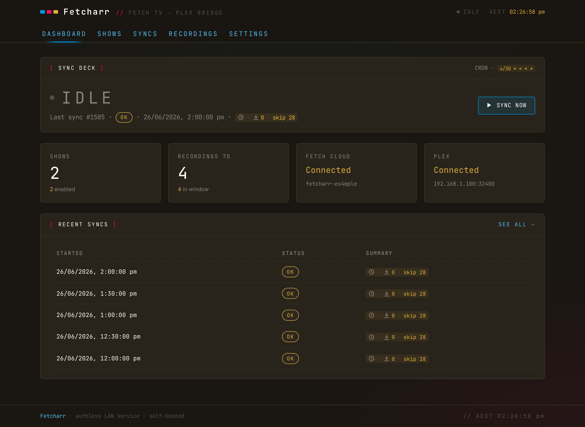
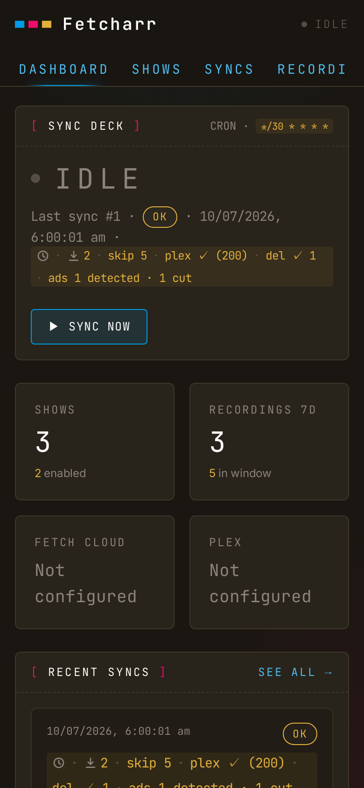
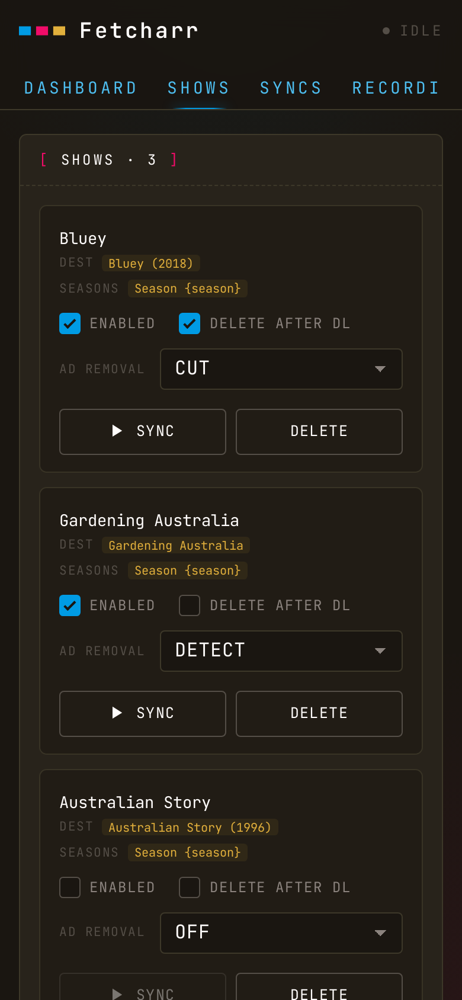
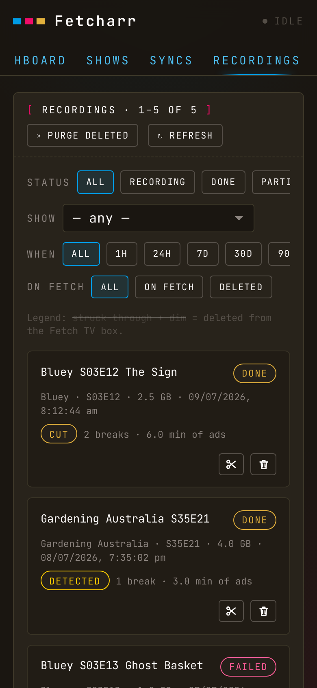

# What Fetcharr is

Your Fetch TV box records the shows you tell it to, then the recordings sit on the box, watchable only through Fetch's own interface. Fetcharr watches the box on your LAN, downloads new episodes of shows you mark to follow, drops the files into your Plex TV library, pokes Plex to scan, and optionally deletes the recording from the Fetch box once Plex confirms the file.

If your media stack is Fetch TV → Plex, Fetcharr is the automation in between: schedule recordings on the box as usual, and they turn up in Plex named and foldered.

## What Fetcharr isn't

- **Not an indexer integration** (Sonarr / Radarr / Prowlarr). Fetcharr only consumes what Fetch has already recorded; it doesn't tell Fetch what to record. Use the box's own EPG to schedule recordings.
- **Not authenticated.** It's designed for trusted LAN deployments. CSRF, rate-limiting, and a strict CSP are in place, but there's no login. Don't expose it to the internet; see the [security model](/deep-dive#security-model).
- **Not a remuxer or transcoder.** Files land as `.ts` from the box and stay `.ts`. The optional ad-cutting is a keyframe stream-copy, not a re-encode. Add Tdarr or similar downstream if you need `.mkv`.
- **Not a notifier.** No Discord / ntfy / push integration.

> [!IMPORTANT] 
> Tested against a Fetch TV Mighty 3 and Plex Media Server. Other Fetch hardware and firmware are unverified.

## Where next

- **[Getting started](/guide/getting-started)** — run it with Docker and walk the first-run wizard.
- **[Following shows](/guide/following-shows)** — mark shows to follow and point them at library folders.
- **[Recordings](/guide/recordings)** and **[Syncs](/guide/syncs)** — watch downloads happen and read the status of each one.
- **[Ad removal](/guide/ad-removal)** — the optional comskip detect/cut pass.
- **[Plex](/guide/plex)** and **[Delete from Fetch](/guide/delete-from-fetch)** — the two optional integrations.
- **[Configuration](/guide/configuration)** and **[Troubleshooting](/guide/troubleshooting)** — the deploy knobs and the fixes for common snags.

It adapts to a phone, too: every view collapses to cards and swipeable chip rows below tablet width.

