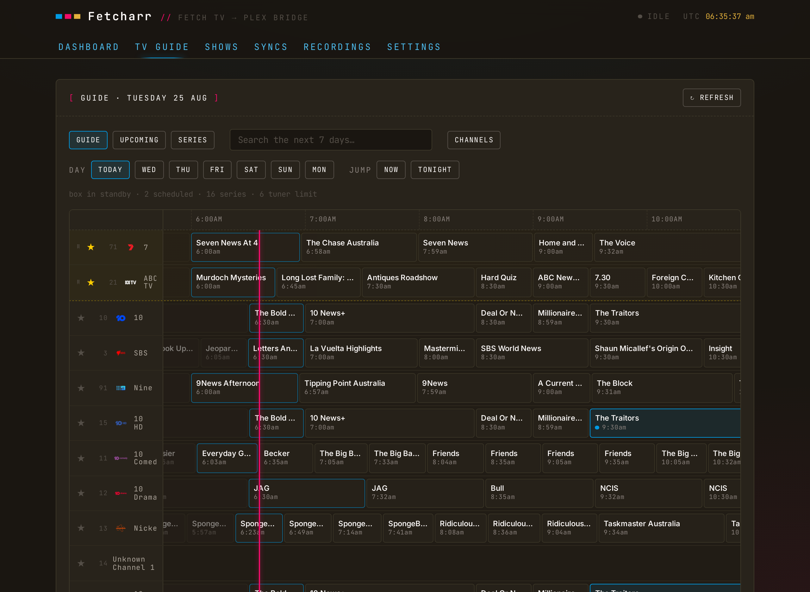

# TV Guide

The TV Guide tab is a 7-day programme guide for your Fetch box, in the browser. Click a programme to record it, cancel it, or set a series recording; the command goes to the box through Fetch's cloud service, the same way the official Fetch mobile app does it. Combined with [following shows](/guide/following-shows), schedule a series here and Fetcharr downloads each episode into Plex as the box records it.

## Setup

The guide needs your Fetch cloud login (the same activation code and PIN that [Delete from Fetch](/guide/delete-from-fetch) uses). Enter both under Settings → Fetch Cloud and press `TEST CONNECTION`. The activation code (your Fetch ID) is on the box under `Menu → Manage → Settings → Device Info`, or at `fetchtv.com.au` under "Where's my code".

## The grid

Channels run down the page, time runs across, and a magenta line marks now. The guide opens scrolled to the current half hour.

- **Day chips** switch between today and the next six days; `NOW` and `TONIGHT` jump within the day.
- **Search** scopes to the section you are on. On the grid it searches the full 7 days of programmes; on `UPCOMING` and `SERIES` it filters the list as you type. Switching sections clears the query. Every result card opens the programme detail.
- The **filter box** in the top-left corner narrows the rows by channel name or number as you type.
- Cell borders show recording state: blue for scheduled, gold for a series recording, pulsing magenta for recording right now. A scheduled episode that comes from a series recording carries a gold dot next to the blue one. The programme airing now on each channel is lifted brighter.
- The status line above the grid reports the box (online or standby), the scheduled count, and the tuner limit.
- Drag the rail's right edge to resize it, from icons-only up to full channel names; the width is remembered per browser.
- Duplicate channel listings from the box are removed, and an HD simulcast that Fetch names identically to its SD sibling is labelled `HD`.

## Recording a programme

Click a cell to open its detail: synopsis, rating, season and episode, and the channel artwork. From there:

- **RECORD** schedules the single airing. `START EARLY` and `RUN LATE` pad the timer (3 and 5 minutes by default) so late-running broadcasts don't clip.
- **RECORD SERIES** sets a series tag on the box, with an episodes-to-keep option.
- A scheduled programme shows **CANCEL RECORDING** instead. If the episode belongs to a series recording, cancelling asks whether to cancel just that episode or the whole series.
- A programme whose show carries a series tag but has no episode scheduled yet shows the tag with a **CANCEL SERIES** action.

The **UPCOMING** view lists what will record: the timers the box has set (`SCHEDULED`, marked `SERIES` or `ONE-OFF`), plus the episodes your series tags are expected to catch over the next 7 days (`SERIES` · `EXPECTED`). The box only sets a timer shortly before airtime, so the expected entries are how tomorrow's episodes show up. **SERIES** lists the box's series tags. A card in either view opens the programme detail, where you record or cancel; a series card opens its next airing.

A series tag belongs to one channel. An SD channel and its HD simulcast are separate channels to Fetch, so the same show appears once per channel in search, and a series set on the HD channel does not cover the SD airings; the channel logos on each row show which is which.

## Pinned channels

Press the ★ next to a channel in the rail to pin it; the row animates up into the pinned block. Pinned channels sit at the top of the grid in your order, with a gold tint; drag a pinned row by any part of its rail cell to reorder (a ghost of the row follows your pointer), or use the arrows in the `CHANNELS` dialog. When the pinned block scrolls out of view, a `↑ PINNED` chip appears; click it to jump back to the top.

`⚙ CHANNELS` (in the panel header, next to `⟳ REFRESH`) also hides channels you never watch (a pinned channel can't be hidden; pinning unhides it), sorts the unpinned rest by box order, channel number, or name, and has a `HIDE SD SIMULCASTS` switch: it hides an SD channel only when its HD twin is in the lineup, so SD-only channels stay. The switch applies to the grid and search.

## On a phone

The guide works in the phone browser: the channel rail narrows, programme and channel dialogs open as bottom sheets, and the rail cells drag to reorder pins by touch. On iOS, add Fetcharr to the Home Screen (Share → Add to Home Screen) to run it full-screen without Safari's toolbar; in Safari itself the sheets are sized so their buttons stay above the toolbar.

## On the dashboard

With the cloud connection configured, the dashboard gains a TV Guide panel: what's on now across your pinned channels (with the start time, minutes remaining, and a progress bar for each programme), what's on next, and the next few scheduled recordings, each marked series or one-off.

## When the box is asleep

Guide data comes from Fetch's cloud, so browsing keeps working while the box is in standby (Fetcharr caches the channel lineup). Scheduling and cancelling need the box reachable; Fetcharr sends a wake command and retries, but if a command still times out, wake the box (or open it in the Fetch mobile app) and retry.

If Fetch's cloud rate-limits Fetcharr (HTTP 429), the guide keeps serving its cached copy with a note above the grid, honours the retry hints Fetch sends, and refreshes itself once the limit lifts.

> [!NOTE] 
> The guide uses the same unofficial cloud API as the official Fetch apps. If Fetch changes that API, the guide can stop working until Fetcharr is updated.
